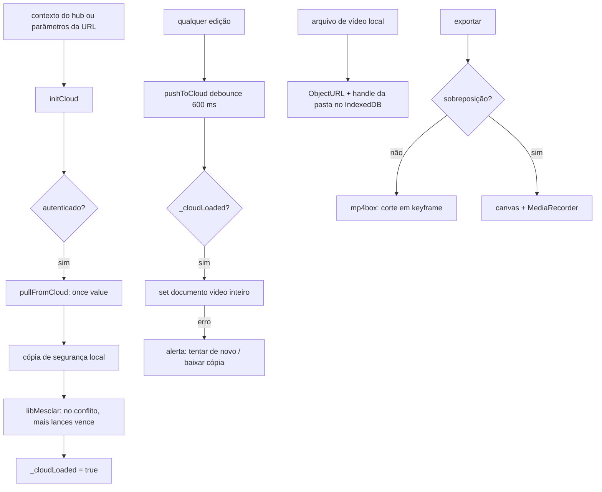

# Fluxo — `video`

> Archaeologist, 2026-10-13. Detalhes e referências de linha em `../code-analysis.md`.

```mermaid
flowchart TD
  C[contexto do hub ou parâmetros da URL] --> IC[initCloud]
  IC --> A{autenticado?} -- sim --> PL[pullFromCloud: once value]
  PL --> BK[cópia de segurança local] --> MX[libMesclar: no conflito, mais lances vence]
  MX --> OK[_cloudLoaded = true]
  ED[qualquer edição] --> PU[pushToCloud debounce 600 ms]
  PU --> G{_cloudLoaded?} -- sim --> SET[set documento video inteiro]
  SET -- erro --> AL[alerta: tentar de novo / baixar cópia]
  V[arquivo de vídeo local] --> OU[ObjectURL + handle da pasta no IndexedDB]
  EX[exportar] --> K{sobreposição?}
  K -- não --> MP[mp4box: corte em keyframe]
  K -- sim --> MR[canvas + MediaRecorder]
```
